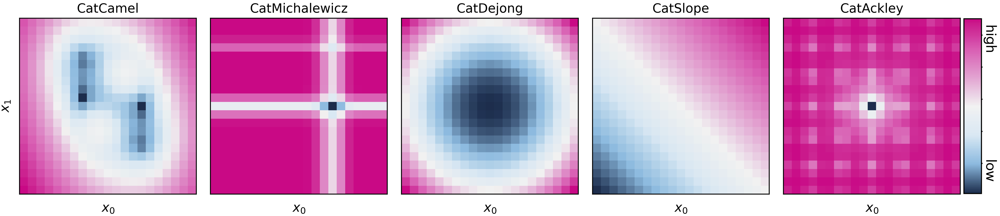
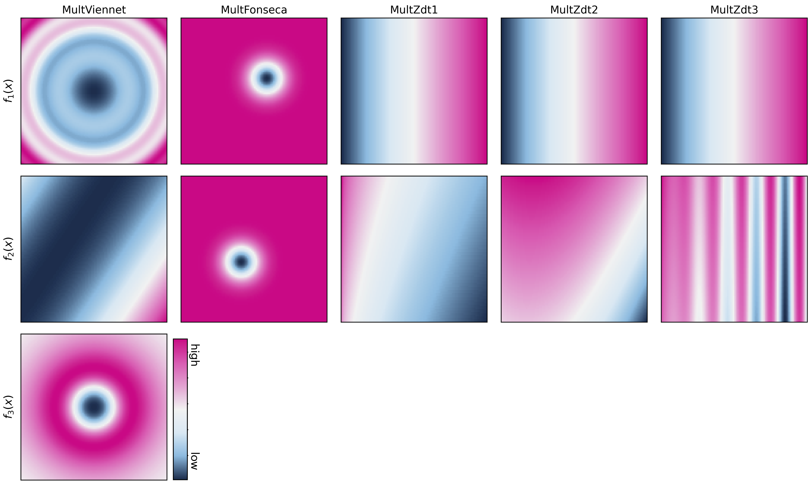

.. _surfaces:

Surfaces
========

**Olympus** provides a number of analytical functions that can be used to benchmark optimization algorithms.

These can be accessed by importing the specific surface class
from the ``olympus.surfaces`` module, or via the ``Surface`` function. For instance, to load the *Branin* function,
you can use the ``Surface`` function::

    from olympus import Surface
    surface = Surface(kind='Branin')

The above is equivalent to importing the class ``Branin`` directly::

    from olympus.surfaces import Branin
    surface = Branin()

This latter approach, however, allows for more control over the details of the function chosen. For instance, the
*Michalewicz* also has a parameter `m` that controls the steepness of its valleys::

    from olympus.surfaces import Michalewicz
    surface = Michalewicz(param_dim=2, m=15)

Once a surface instance is defined, it can be evaluated as follows::

    surface.run([0.5, 0.5])
    >>> [ParamVector(target_0 = -1.000030517578125)]

    # evaluate a batch of points
    surface.run([[0.5, 0.5], [0.75, 0.75]])
    >>> [ParamVector(target_0 = -1.000030517578125),
         ParamVector(target_0 = -0.39509650003663577)]

Traditional Surfaces
--------------------

.. toctree::
   :maxdepth: 1

   ackley_path
   branin
   dejong
   hyper_ellipsoid
   levy
   michalewicz
   rastrigin
   rosenbrock
   schwefel
   styblinski_tang
   zakharov

Discrete Surfaces
-----------------

.. toctree::
   :maxdepth: 1

   discrete_ackley
   discrete_double_well
   discrete_michalewicz
   linear_funnel
   narrow_funnel

Gaussian Mixture Surfaces
-------------------------

.. toctree::
   :maxdepth: 1

   gaussian_mixture
   denali
   everest
   k2
   kilimanjaro
   matterhorn
   mont_blanc

Categorical Surfaces
--------------------

.. toctree::
   :maxdepth: 1

   cat_camel
   cat_michalewicz
   cat_dejong
   cat_slope
   cat_ackley

Multi-objective surfaces
------------------------

.. toctree::
   :maxdepth: 1

   mult_fonseca
   mult_viennet
   mult_zdt1
   mult_zdt2
   mult_zdt3

Plots
-----

Below is an image that summarises all the continous, single-objective analytical surfaces available in **Olympus**.

.. image:: ../../_static/all_surfaces.png
   :align: center

Below is an image that summarises all the categorcial, single-objective analytical surfaces available in **Olympus**.

Below is an image that summarises all the continuous, multi-objective analytical surfaces available in **Olympus**.

Surface Function
----------------

.. currentmodule:: olympus.surfaces

.. autofunction:: Surface
   :noindex:
