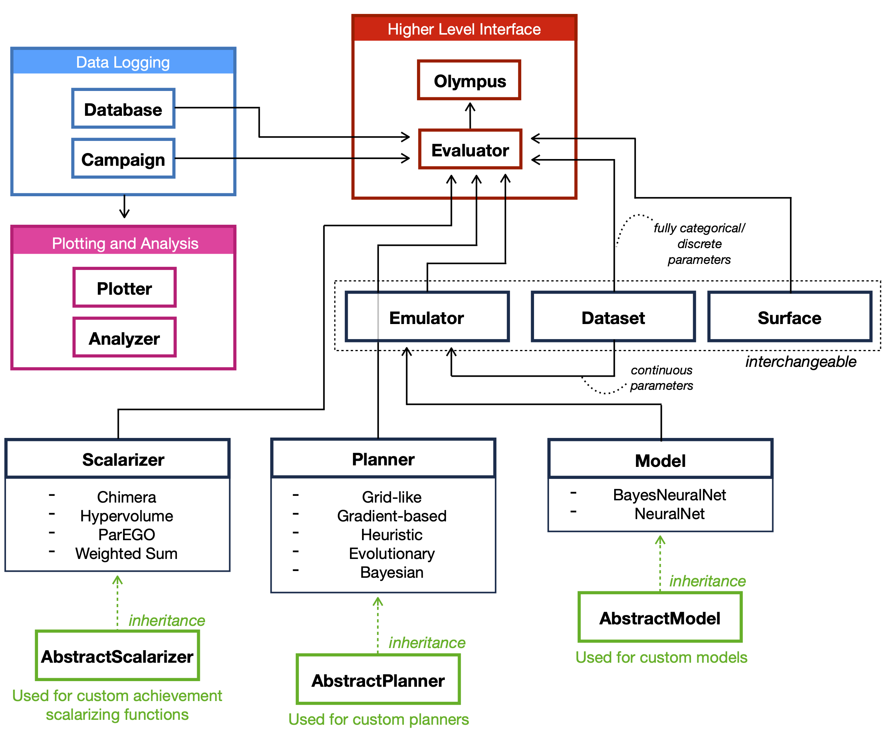

Overview
========

**Olympus** is structured in the following way...

The core classes are...

A Dataset and a Model make an Emulator, which together with a Planner make an Evaluator etc etc...

We wrap a number of planners, so see :ref:`planners`

etc etc

